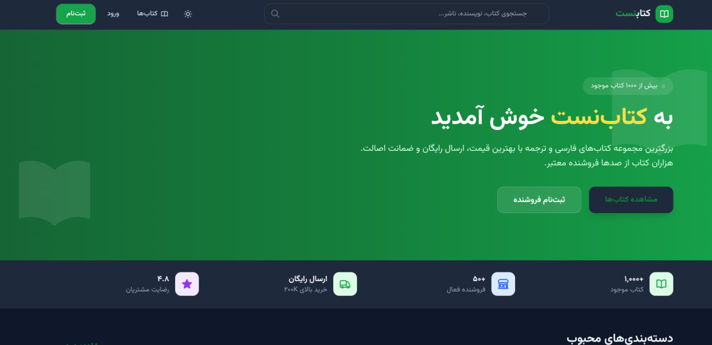
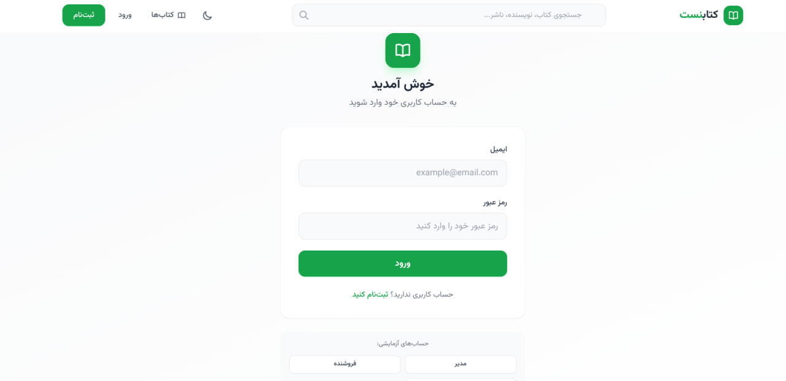
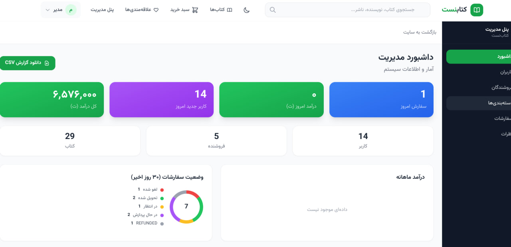

# BookNest — Multi-Vendor Bookstore Platform

> A full-stack multi-vendor bookstore with Persian RTL UI, built with Next.js + NestJS + SQLite (no Docker required).

---

## Screenshots





---

## Quick Start (No Docker)

```bash
git clone https://github.com/danialchoopan/danialBookStoreNest.git
cd danialBookStoreNest

# Backend
cd backend && npm install && npx prisma generate && npx prisma migrate dev --name init && npm run prisma:seed && npm run start:dev

# Frontend (new terminal)
cd frontend && npm install && npm run dev
```

Open **http://localhost:3000** — Login with `admin@booknest.ir` / `admin123`

---

## What's Included

| Feature | Description |
|---------|-------------|
| Auth | JWT login, 3 roles (Admin/Seller/Customer), demo accounts |
| Books | 30 seeded books with ISBNs, search, filtering, pagination |
| Ebook/PDF | Sell physical books, ebooks, or both with separate pricing |
| Free Ebooks | Support for free downloadable ebooks |
| In-Browser Reader | Built-in PDF reader with dark mode and fullscreen |
| My Books | Personal library of purchased ebooks with download |
| Cart | Add/remove/update, multi-step checkout |
| Orders | Status tracking timeline, 22 sample orders |
| Reviews | 25 reviews with ratings and Persian comments |
| Wishlist | Save books for later |
| Seller Dashboard | Stats, products, orders, wallet, PDF upload |
| Admin Dashboard | Real-time analytics, order management, reviews moderation |
| Search | Autocomplete with book + category suggestions |
| Dark Mode | Toggle with localStorage persistence |
| Mobile | Responsive design with touch-friendly targets |
| Email | Order confirmation + status update templates |
| WebSocket | Live order status updates |
| CSV Export | Sales reports with proper UTF-8 support |

---

## Tech Stack

| Layer | Tech |
|-------|------|
| Frontend | Next.js 14, React, Tailwind CSS, Zustand, TanStack Query |
| Backend | NestJS, Prisma ORM, Socket.io |
| Database | SQLite (local dev) / PostgreSQL (production) |
| Cache | Redis (optional) |

---

## Project Structure

```
danialBookStoreNest/
├── backend/          # NestJS API (port 4000) — 20 modules
├── frontend/         # Next.js App (port 3000) — 20+ pages, RTL
├── docs/             # HTML documentation (10 pages)
├── screenshots/      # App screenshots
├── docker-compose.yml
└── README.md
```

---

## API Endpoints

| Endpoint | Method | Description |
|----------|--------|-------------|
| `/api/auth/login` | POST | User login |
| `/api/auth/register` | POST | User registration |
| `/api/books` | GET | List books with filters |
| `/api/books/:id` | GET | Book detail |
| `/api/cart` | GET/POST | Cart operations |
| `/api/orders` | POST | Create order |
| `/api/downloads/my-books` | GET | Purchased ebooks |
| `/api/downloads/:bookId` | GET | Download/view ebook PDF |
| `/api/admin/analytics` | GET | Admin analytics data |
| `/api/admin/orders/:id/status` | PATCH | Update order status |

Full API docs available at **http://localhost:4000/api/docs** (Swagger)

---

## Demo Accounts

| Role | Email | Password |
|------|-------|----------|
| Admin | admin@booknest.ir | admin123 |
| Seller | seller1@booknest.ir | seller123 |
| Customer | customer1@booknest.ir | customer123 |

---

## License

MIT

---

---

# کتاب‌نست — پلتفرم فروشگاه کتاب چند فروشنده‌ای

> یک فروشگاه آنلاین کتاب چند فروشنده‌ای با رابط کاربری فارسی RTL، ساخته شده با Next.js + NestJS + SQLite (بدون نیاز به Docker).

---

## شروع سریع (بدون Docker)

```bash
git clone https://github.com/danialchoopan/danialBookStoreNest.git
cd danialBookStoreNest

# بک‌اند
cd backend && npm install && npx prisma generate && npx prisma migrate dev --name init && npm run prisma:seed && npm run start:dev

# فانتند (ترمینال جدید)
cd frontend && npm install && npm run dev
```

باز کردن **http://localhost:3000** — ورود با `admin@booknest.ir` / `admin123`

---

## امکانات

| قابلیت | توضیحات |
|--------|---------|
| احراز هویت | ورود JWT، ۳ نقش (مدیر/فروشنده/کاربر)، حساب‌های آزمایشی |
| کتاب‌ها | ۳۰ کتاب نمونه با شابک، جستجو، فیلتر، صفحه‌بندی |
| کتاب الکترونیکی | فروش کتاب فیزیکی، الکترونیکی، یا هر دو با قیمت جداگانه |
| کتاب‌های رایگان | پشتیبانی از کتاب‌های الکترونیکی رایگان قابل دانلود |
| خواننده داخلی | خواننده PDF داخلی با حالت تاریک و تمام صفحه |
| کتابخانه من | کتابخانه شخصی کتاب‌های خریداری شده با دانلود |
| سبد خرید | افزودن/حذف/ویرایش، تسویه حساب چند مرحله‌ای |
| سفارشات | پیگیری وضعیت، ۲۲ سفارش نمونه |
| نظرات | ۲۵ نظر با امتیاز و کامنت فارسی |
| علاقه‌مندی‌ها | ذخیره کتاب‌ها برای بعد |
| داشبورد فروشنده | آمار، محصولات، سفارشات، کیف پول، آپلود PDF |
| داشبورد مدیر | آنالیتیکس واقعی، مدیریت سفارشات، مدیریت نظرات |
| جستجو | پیشنهادات خودکار با کتاب و دسته‌بندی |
| حالت تاریک | تغییر با ذخیره در localStorage |
| موبایل | طراحی ریسپانسیو با هدف‌های لمسی |
| ایمیل | قالب‌های تأیید سفارش و بروزرسانی وضعیت |
| WebSocket | بروزرسانی زنده وضعیت سفارش |
| خروجی CSV | گزارش‌های فروش با پشتیبانی UTF-8 |

---

## فناوری‌ها

| لایه | فناوری |
|------|--------|
| فانتند | Next.js 14, React, Tailwind CSS, Zustand, TanStack Query |
| بک‌اند | NestJS, Prisma ORM, Socket.io |
| پایگاه داده | SQLite (develop) / PostgreSQL (تولید) |
| کش | Redis (اختیاری) |

---

## ساختار پروژه

```
danialBookStoreNest/
├── backend/          # بک‌اند NestJS (پورت ۴۰۰۰) — ۲۰ ماژول
├── frontend/         # اپلیکیشن Next.js (پورت ۳۰۰۰) — ۲۰+ صفحه، RTL
├── docs/             # مستندات HTML (۱۰ صفحه)
├── screenshots/      # اسکرین‌شات‌های اپلیکیشن
├── docker-compose.yml
└── README.md
```

---

## حساب‌های آزمایشی

| نقش | ایمیل | رمز عبور |
|------|-------|----------|
| مدیر | admin@booknest.ir | admin123 |
| فروشنده | seller1@booknest.ir | seller123 |
| کاربر | customer1@booknest.ir | customer123 |

---

## لایسنس

MIT
